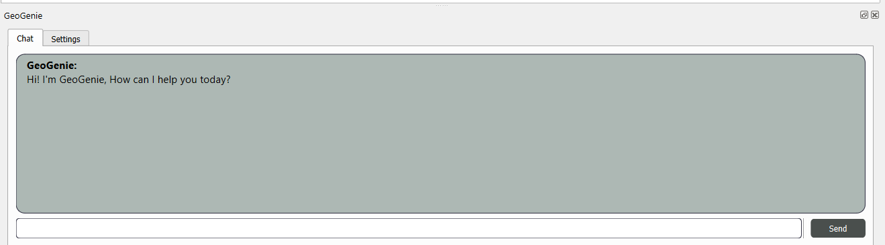
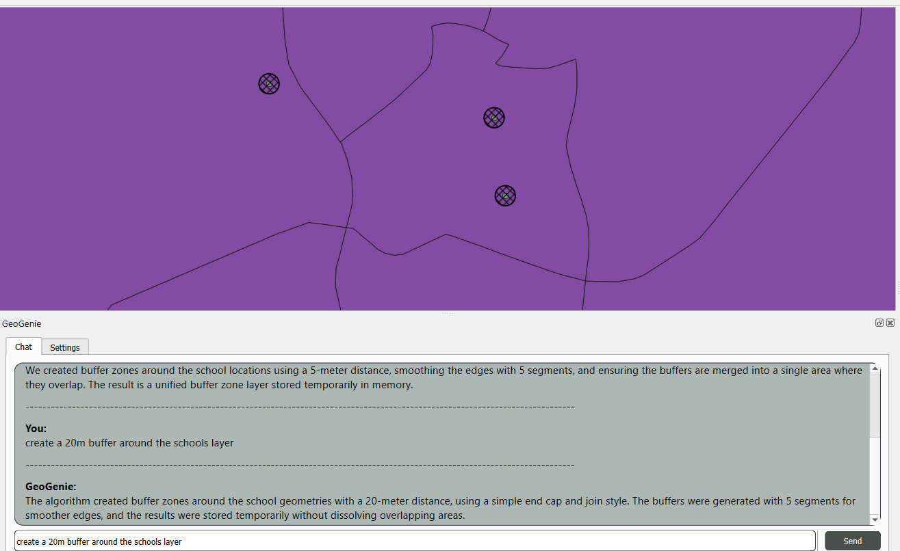
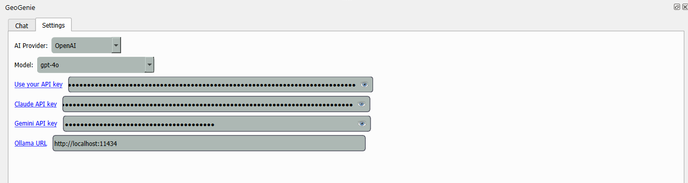
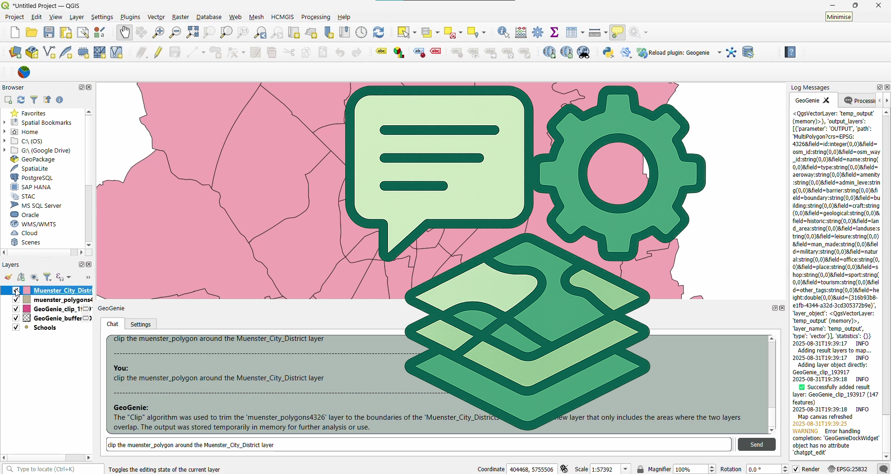

# GeoGenie 🌍🪄🤖

<div align="center">
  
  
  **Natural Language Geospatial Analysis for QGIS**
  
  Transform your geographic questions into powerful QGIS operations using AI
  
  [](#contributing)
  [](#)
  [](#license)
  [](#prerequisites)
  
  [View Demo](#demo) • [Report Bug](https://github.com/TRON-151/GeoAgent/issues) • [Request Feature](https://github.com/TRON-151/GeoAgent/issues)

</div>

---

## 📋 Table of Contents

- [About GeoGenie](#about-geogenie)
- [Features](#features)
- [GeoGenie_UI](#GeoGenie_UI)
- [Getting Started](#getting-started)
- [Usage](#usage)
- [AI Capabilities](#ai-capabilities)
- [Roadmap](#roadmap)
- [Contributing](#contributing)
- [License](#license)
- [Contact](#contact)

## 🌟 About GeoGenie

GeoGenie is a QGIS plugin that bridges the gap between natural language and complex geospatial analysis. Simply ask questions in plain English, and GeoGenie will understand your intent and execute the appropriate QGIS operations using advanced AI models.

### 🛠️ Built With

- **Python** - Core plugin development
- **QGIS API** - Geospatial processing integration
- **OpenAI GPT-4** - Natural language understanding
- **Anthropic Claude** - Advanced AI reasoning
- **Google Gemini** - Multi-modal analysis
- **ONNX Runtime** - AI model inference
- **OpenCV** - Computer vision processing

## ✨ Features

### 🗣️ Natural Language Processing
- Ask questions in plain English
- No need to learn complex QGIS workflows
- Intelligent parameter extraction and validation

### 🤖 Multiple AI Providers
- **OpenAI GPT-4o** - Advanced language understanding
- **Anthropic Claude** - Detailed reasoning and analysis  
- **Google Gemini** - Multi-modal capabilities
- **Ollama** - Local AI model support

### 🌍 Geospatial Operations
- Buffer analysis and proximity studies
- Layer clipping and intersection
- Coordinate system transformations
- Spatial joins and overlays
- **AI-Powered Road Detection** 🚗
- **Building Footprint Extraction** 🏢

### 🔒 Security & Privacy
- API keys stored locally and encrypted
- No data sent to external servers (except AI APIs)
- Full control over your geospatial data

## 📸 GeoGenie_UI

<div align="center">

### Main Interface


*Clean, intuitive chat interface integrated seamlessly into QGIS*

### Natural Language Interaction


*Simply ask questions and get instant geospatial analysis results*

### API Configuration


*Easy setup with multiple AI provider support*

</div>

## 🚀 Getting Started

### Prerequisites

- **QGIS 3.x** - Download from [qgis.org](https://qgis.org)
- **Python 3.7+** - Usually included with QGIS
- **API Key** - From at least one AI provider

### Installation

#### Option 1: Automatic Installation (Recommended)

1. **Download GeoGenie**
   ```bash
   # Clone the repository
   git clone https://github.com/your-username/GeoGenie.git
   ```

2. **Install to QGIS**
   - Copy the `geogenie` folder to your QGIS plugins directory:
     - **Windows**: `C:\Users\%USERNAME%\AppData\Roaming\QGIS\QGIS3\profiles\default\python\plugins\`
     - **macOS**: `~/Library/Application Support/QGIS/QGIS3/profiles/default/python/plugins/`
     - **Linux**: `~/.local/share/QGIS/QGIS3/profiles/default/python/plugins/`

3. **Enable Plugin**
   - Open QGIS → Plugins → Manage and Install Plugins
   - Find "GeoGenie" and enable it
   - The plugin will automatically install required dependencies

#### Option 2: Manual Installation

1. **Install Dependencies**
   ```bash
   # For QGIS Python environment
   pip install openai>=1.0.0 anthropic>=0.18.0 onnxruntime>=1.15.0 opencv-python>=4.8.0 pillow>=9.0.0 google-generativeai
   ```

2. **macOS Users** (QGIS 3.x)
   ```bash
   /Applications/QGIS.app/Contents/MacOS/bin/python3 -m pip install openai>=1.0.0 anthropic>=0.18.0 onnxruntime>=1.15.0 opencv-python>=4.8.0 pillow>=9.0.0
   ```

### Quick Setup

1. **Launch GeoGenie** from the QGIS toolbar
2. **Add API Key** in the Settings tab:
   - OpenAI: Get from [platform.openai.com](https://platform.openai.com/account/api-keys)
   - Claude: Get from [console.anthropic.com](https://console.anthropic.com/)
   - Gemini: Get from [makersuite.google.com](https://makersuite.google.com/app/apikey)
3. **Start Analyzing** - Type your first question!

## 💬 Usage

### Basic Operations

```
🌍 "Create a 500 meter buffer around the schools layer"
📏 "Calculate the area of each polygon in the districts layer"
✂️ "Clip the roads layer with the city boundary"
🔄 "Reproject the buildings layer to EPSG:4326"
📍 "Find all points within 1km of the coastline"
```

### AI-Powered Feature Detection (Phase 2 - In Development)

```
🛣️ "Find roads in this satellite image" ✅ Working
🏢 "Extract building footprints from aerial imagery" 🚧 In Development
```

*Note: Road detection is partly functional with high-resolution satellite imagery. Building segmentation and other computer vision features are under active development.*

### 🎬 Demo

[](Demo_Video/DEMO_GeoGenie.mp4)

*Click the image above to watch how Geogenie Works*


## 🧠 AI Capabilities

### Phase 1: Natural Language Processing ✅
- Text-based geospatial queries
- Parameter validation and confirmation
- Real-time progress feedback
- Multi-provider AI support

### Phase 2: Computer Vision (Current) 🚧
- **Road Network Detection** - Automatic extraction from satellite imagery
- **Building Segmentation** - AI-powered building footprint identification
- **Feature Classification** - Smart categorization of geographic features

### Phase 3: Advanced Analytics (Planned) 📋
- Temporal analysis and change detection  
- 3D spatial analysis capabilities
- Real-time data integration
- Custom model training interface

## 🗺️ Roadmap

- [x] **Phase 1** - Natural Language Processing
  - [x] OpenAI GPT integration
  - [x] Claude and Gemini support
  - [x] Parameter validation system
  - [x] QGIS algorithm execution

- [x] **Phase 2** - AI Computer Vision
  - [x] Road detection from satellite imagery
  - [x] ONNX model integration
  - [ ] Building footprint extraction
  - [ ] Multi-class feature segmentation

- [ ] **Phase 3** - Advanced Features
  - [ ] Custom model training
  - [ ] Real-time data streams
  - [ ] 3D analysis capabilities
  - [ ] Cloud processing integration

## 🤝 Contributing

We welcome contributions! Here's how you can help:

1. **Fork** the repository
2. **Create** a feature branch (`git checkout -b feature/AmazingFeature`)
3. **Commit** your changes (`git commit -m 'Add some AmazingFeature'`)
4. **Push** to the branch (`git push origin feature/AmazingFeature`)
5. **Open** a Pull Request

### Development Setup

```bash
# Clone the repo
git clone https://github.com/your-username/geogenie.git

# Install development dependencies
pip install -e .

# Run tests
python -m pytest tests/
```

## 🐛 Known Issues

- Road segmentation requires high-resolution satellite imagery for best results
- Large raster processing may require significant memory
- Some AI providers have rate limits for API calls

## 📝 License

This project is licensed under the GPL-2.0 License - see the [LICENSE](LICENSE) file for details.

## 📞 Contact

**Ahmad Abubakar Ahmad**
- Email: aabubaka@uni-muenster.de 
- GitHub: [@AhmadAbubakarAhmadA](https://github.com/AhmadAbubakarAhmadA)
- Project: [GeoGenie](https://github.com/TRON-151/GeoAgent)

## 🙏 Acknowledgments

- [QGIS](https://qgis.org) - The amazing open-source GIS platform
- [Deepness Project](https://github.com/PUTvision/qgis-plugin-deepness) - ONNX models for remote sensing
- [OpenAI](https://openai.com) - GPT models for natural language understanding
- [Anthropic](https://anthropic.com) - Claude AI for advanced reasoning
- [University of Münster](https://uni-muenster.de) - Academic support and resources

---

<div align="center">
  
**Made with ❤️ for the geospatial community**

[⬆ Back to Top](#geogenie-)

</div>
